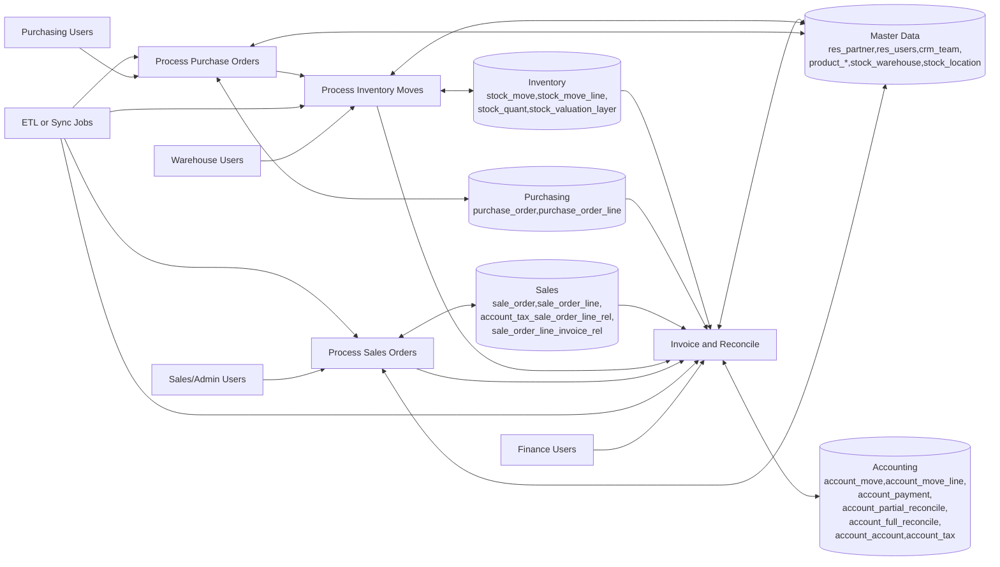
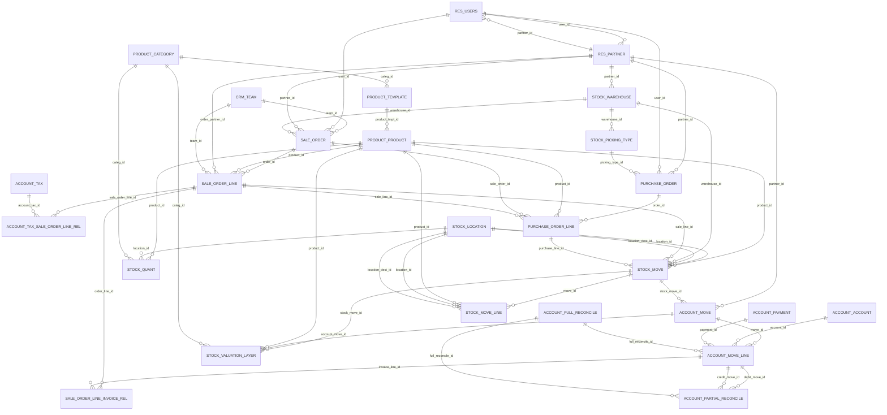

# erp_raw Data Flow & Entity Model

Generated on: 2026-03-07  
Database: `sales_warehouse`  
Schema: `erp_raw`

## Scope and Method

- This schema contains 29 base tables and 1,038 columns.
- No explicit primary-key/foreign-key constraints are declared in `information_schema`.
- ERD relationships below are inferred from Odoo-style naming and validated by ID-match checks on live data.

## DFD (Level 1)

## ERD (Inferred + Live-Validated)

## Relationship Validation Notes

Validated using distinct non-null `*_id` values joined to target table `id`.

- Most inferred relationships are exact or near-exact (`0.00%` unmatched IDs).
- Minor unmatched keys observed:
  - `sale_order_line.order_id -> sale_order.id`: 33 distinct unmatched IDs (`0.06%`)
  - `sale_order_line.order_partner_id -> res_partner.id`: 2 (`0.04%`)
  - `account_tax_sale_order_line_rel.sale_order_line_id -> sale_order_line.id`: 15 (`~0.00%`)
  - `stock_move.sale_line_id -> sale_order_line.id`: 15 (`~0.00%`)

These are typically ETL lag, soft-deleted upstream records, or historical drift.

## Table Catalog (erp_raw)

| Table | Rows |
|---|---:|
| `account_account` | 620 |
| `account_account_type` | 19 |
| `account_full_reconcile` | 31,639 |
| `account_move` | 540,248 |
| `account_move_line` | 1,587,645 |
| `account_partial_reconcile` | 66,112 |
| `account_payment` | 42,852 |
| `account_tax` | 19 |
| `account_tax_sale_order_line_rel` | 370,567 |
| `crm_team` | 14 |
| `product_category` | 129 |
| `product_product` | 35,734 |
| `product_template` | 34,710 |
| `purchase_order` | 19,043 |
| `purchase_order_line` | 86,895 |
| `res_country_state` | 1,469 |
| `res_currency_rate` | 1,152 |
| `res_partner` | 27,377 |
| `res_users` | 133 |
| `sale_order` | 54,842 |
| `sale_order_line` | 470,648 |
| `sale_order_line_invoice_rel` | 262,420 |
| `stock_location` | 834 |
| `stock_move` | 1,565,731 |
| `stock_move_line` | 1,017,877 |
| `stock_picking_type` | 83 |
| `stock_quant` | 377,503 |
| `stock_valuation_layer` | 488,308 |
| `stock_warehouse` | 8 |

## Recommended Next Step

If you want strict ERD tooling support (dbdiagram, DBeaver FK graph, etc.), create a curated modeling schema that adds explicit PK/FK constraints on top of `erp_raw`.
